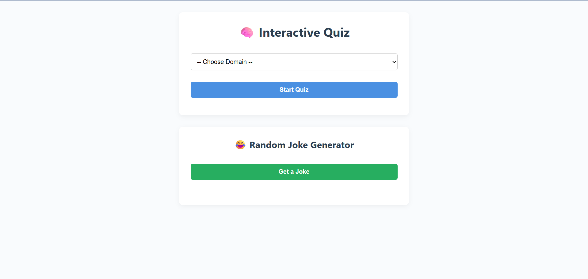
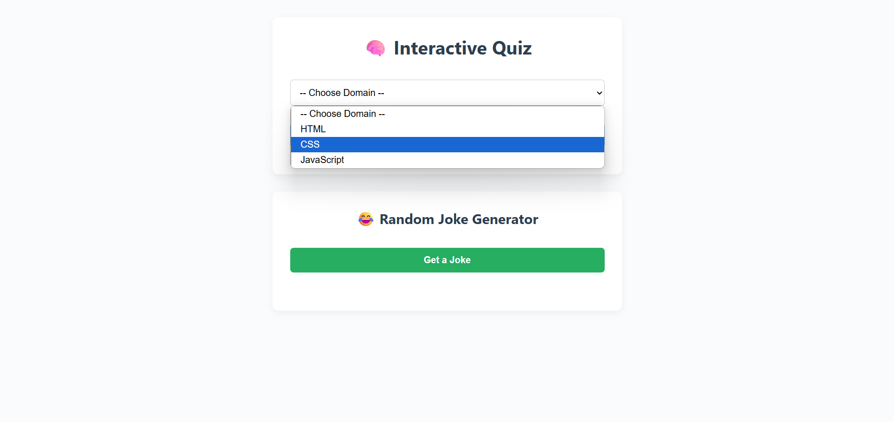
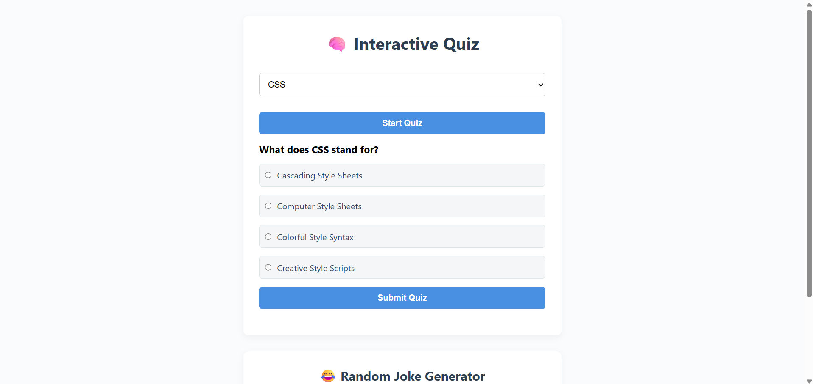
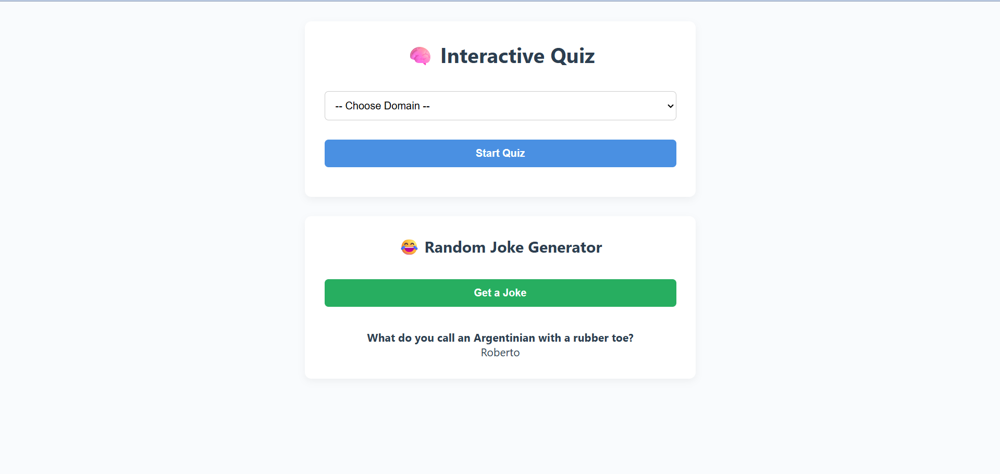

# 🧠 Domain-Based Quiz App

An engaging and educational web application that allows users to test their foundational knowledge in core web development technologies — **HTML**, **CSS**, and **JavaScript** — through domain-specific quizzes. This app is lightweight, fully responsive, and also includes a **Random Joke Generator** to add a fun and refreshing twist after the quiz.

---

## 📖 Project Overview

The **Domain-Based Quiz App** is designed to help beginner-level web developers and students practice and reinforce their understanding of essential web technologies.

### 👇 How it Works:
1. The user is presented with a dropdown menu to choose a quiz domain: **HTML**, **CSS**, or **JavaScript**.
2. Once the user selects a domain and clicks "Start Quiz", a set of **5 beginner-friendly multiple-choice questions** appear one at a time.
3. The user selects an answer for each question and submits the quiz.
4. At the end, the app displays the user’s **final score** with an encouraging message.
5. The user can also click on the **"Get a Joke"** button to receive a **random programming joke** from the Official Joke API, making the app both educational and enjoyable.

### 🧑‍💻 Why this project?
- Built entirely using **HTML**, **CSS**, and **Vanilla JavaScript**.
- A great starting point for those learning DOM manipulation and basic interactivity.
- Showcases how to use **API fetching**, conditional rendering, and modular data structures in JS.

---

## 🚀 Features

- ✅ Domain-based quiz selection (HTML, CSS, JavaScript)
- ✍️ 5 simple multiple-choice questions per domain
- 📊 Automatic score calculation and feedback
- 😂 Random Joke Generator using public API
- 💻 Responsive and lightweight design
- 🌐 No frameworks — pure client-side logic

---

## 🧪 How to Run Locally

1. Clone this repository
   git clone https://github.com/Yatheeswar42/Apex-task-3.git
2. Navigate to the project folder
   cd Apex task-2
3. Open index.html in your browser

---

## 🌐 Live Demo

🔗 [Live Demo](https://your-username.github.io/domain-quiz-app/)

---

## 📸 Screenshots

